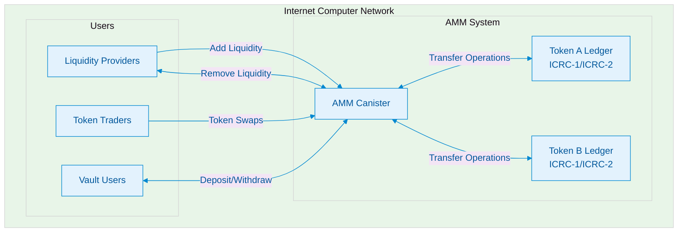
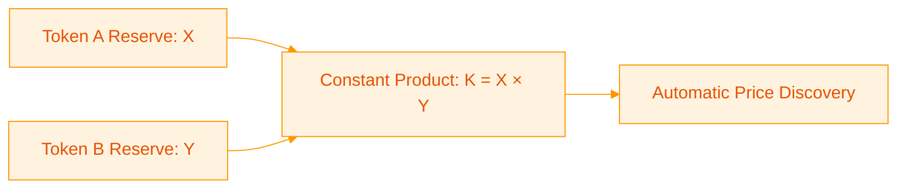
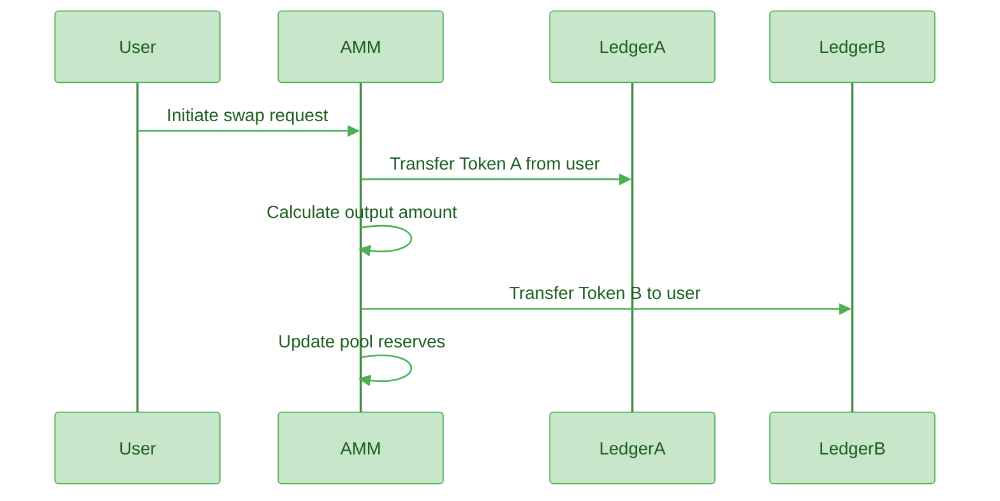

# DeFi AMM - Decentralized Exchange on Internet Computer

>Automated Market Maker built on the Internet Computer Protocol, enabling seamless decentralized trading and liquidity provision.


## Overview

This AMM enables decentralized token trading on the Internet Computer without the need for order books. Users can trade tokens instantly through liquidity pools, while liquidity providers earn fees from every transaction.

The system implements the constant product formula (x × y = k) to automatically determine prices based on supply and demand, creating an efficient and fair trading environment.

## System Architecture



## How It Works

### Liquidity Pools
Liquidity providers deposit pairs of tokens into pools. These pools serve as the source of liquidity for all trades. In return, providers receive LP tokens representing their share of the pool.

### Automated Market Making
The system uses the constant product formula where the product of the two token reserves remains constant during trades:



### Trading Process
When a user wants to swap Token A for Token B:



## Core Features

### Token Swapping
Users can instantly exchange one token for another with a 0.3% trading fee. The system includes slippage protection through minimum output amount specifications.

### Liquidity Provision
Users can deposit token pairs to earn LP tokens and receive a proportional share of all trading fees. Liquidity can be removed at any time, returning the original tokens plus accumulated fees.

### Vault System
A secure deposit and withdrawal system that tracks user balances internally for improved gas efficiency while maintaining full security through ICRC-2 approvals.

### Reserve Management
Real-time tracking of token reserves ensures accurate pricing and liquidity information is always available.


## Mathematical Foundation

### Constant Product Formula
The core pricing mechanism follows: **x × y = k**

Where:
- x = Token A reserve
- y = Token B reserve  
- k = Constant product

### Swap Calculation
When swapping amount `dx` of Token A for Token B:

```
dy = y × dx × 0.997 / (x + dx × 0.997)
```

The 0.997 factor represents the 0.3% trading fee.

### LP Token Valuation
For liquidity provision:
- Initial LP tokens: `sqrt(amount_a × amount_b)`
- Additional LP tokens: `min(amount_a × total_lp / reserve_a, amount_b × total_lp / reserve_b)`

## Candid Functions

### Trading Operations
- `swap(token_in, amount_in, min_amount_out)` - Execute token exchanges
- `get_reserves()` - Retrieve current pool reserves

### Liquidity Management
- `add_liquidity(amount_a, amount_b)` - Provide liquidity to pools
- `remove_liquidity(lp_amount)` - Remove liquidity from pools
- `get_lp_balance()` - Check LP token balance
- `get_total_lp()` - Get total LP token supply

### Vault Operations
- `deposit(amount)` - Deposit tokens to personal vault
- `withdraw(amount, to_account)` - Withdraw tokens from vault
- `balance()` - Check vault balance
- `transfer(amount, to_account)` - Transfer tokens between accounts

